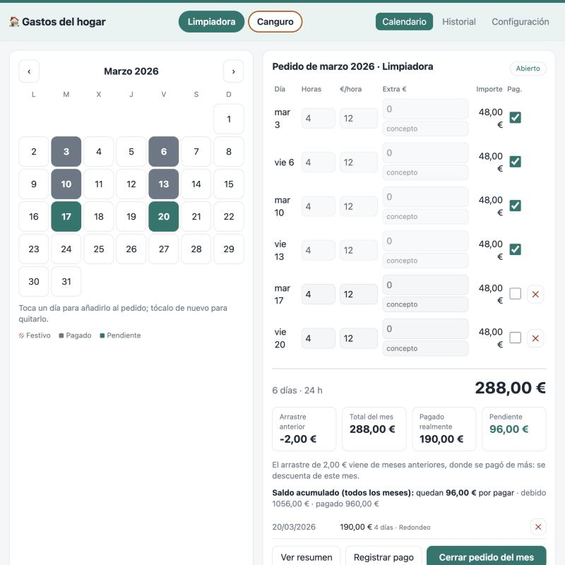
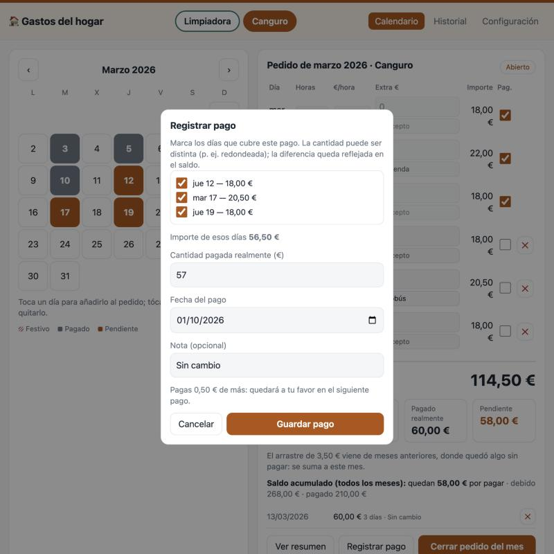
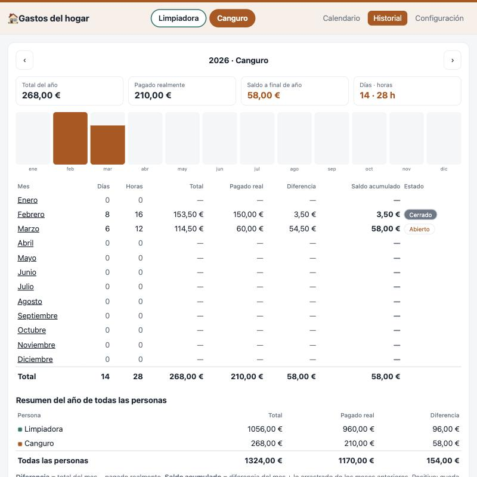
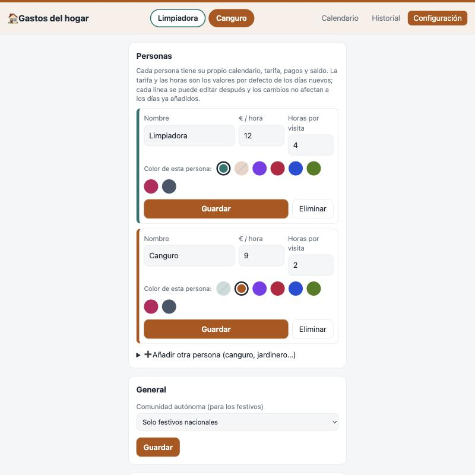

# 🧹 Home Clean Calculator

Aplicación web sencilla para **llevar el control de lo que cuestan las personas que trabajan en tu casa** (limpiadora, canguro…): marcas en un calendario los días que han venido, la app calcula lo que se le debe, y registras los pagos (aunque no sean exactos, por falta de cambio o redondeos) para saber siempre **cuánto queda pendiente**.

Pensada para usarse **en local, en tu propio ordenador**: sin registro, sin login, sin servicios en la nube. Solo PHP + MySQL/MariaDB, HTML, CSS y JavaScript (sin frameworks).

## ✨ Qué hace

- 👥 **Varias personas** (limpiadora, canguro…): cada una con su propio calendario, tarifa, horas por defecto, pagos y saldo. Se cambia de persona con los botones de arriba, y **cada una tiene su color** (que tiñe toda la pantalla) para no equivocarse de calendario.
- 🧾 **Gastos adicionales**: en cada día puedes añadir un extra con su concepto (merienda, transporte…) que se suma al importe.
- 📅 **Calendario mensual**: toca un día para añadirlo al pedido del mes; tócalo otra vez para quitarlo.
- ⚡ **Cálculo automático**: cada día usa por defecto la tarifa y las horas de la configuración, y las puedes editar en cada línea. Los totales se actualizan y se guardan al momento.
- 🇪🇸 **Festivos de España**: se descargan solos (nacionales + tu comunidad autónoma) y se pueden añadir a mano los locales.
- 💶 **Pagos reales y arrastre**: registra cuánto has pagado de verdad y qué días cubre. Si pagas 170 € por 168 €, esos 2 € de más se descuentan del mes siguiente, y cada mes muestra de dónde viene su saldo.
- 🔒 **Cierre de mes**: al terminar el mes cierras el pedido y queda bloqueado con su total.
- 📊 **Historial y resúmenes**: vista anual con gráfico, y resumen imprimible (o PDF) de cada mes.
- 🧪 **Base de pruebas integrada**: un interruptor en Configuración para trastear con datos de ejemplo sin tocar tus datos reales.
- 🗑️ **Borrar todos los datos** desde Configuración, con doble confirmación.

## 📸 Capturas

_Con los datos de ejemplo incluidos en el repositorio (personas y cifras ficticias)._

**Calendario y pedido del mes**: cada persona tiene su color. Los días en gris ya están pagados.

| Limpiadora | Canguro (con gastos extra) |
|---|---|
|  |  |

**Registrar un pago** (aunque no sea exacto) · **Historial anual** · **Personas y colores**

| Registrar pago | Historial | Configuración |
|---|---|---|
|  |  |  |

## 📦 Qué necesitas

| Necesitas | Detalle |
|---|---|
| **PHP 8.1 o superior** | con la extensión `pdo_mysql` (viene activada en XAMPP y MAMP) |
| **MySQL o MariaDB** | cualquier versión reciente |
| Un navegador | Chrome, Firefox, Safari, Edge… |

La forma más fácil de tenerlo todo junto es instalar **XAMPP** (gratis), que incluye PHP, MySQL y un servidor web.

---

## 🚀 Instalación fácil (con XAMPP)

### 1. Instala XAMPP
Descárgalo de <https://www.apachefriends.org> (Windows, macOS o Linux) e instálalo con las opciones por defecto. Elige una versión con **PHP 8.1 o superior**.

### 2. Arranca los servicios
Abre el **panel de control de XAMPP** y pulsa **Start** en **Apache** y en **MySQL**. Ambos deben quedar en verde.

### 3. Descarga esta aplicación
En GitHub pulsa **Code → Download ZIP** y descomprime el archivo (o clona el repositorio con `git clone`).

### 4. Copia la carpeta a XAMPP
Copia la carpeta de la aplicación dentro de la carpeta `htdocs` de XAMPP y llámala **`homeCleanCalculator`**:

| Sistema | Carpeta `htdocs` |
|---|---|
| Windows | `C:\xampp\htdocs\` |
| macOS | `/Applications/XAMPP/xamppfiles/htdocs/` |
| Linux | `/opt/lampp/htdocs/` |

### 5. Ábrela
Entra en tu navegador a:

**<http://localhost/homeCleanCalculator/>**

¡Ya está! **La base de datos y las tablas se crean solas** la primera vez que abres la página. No tienes que importar nada.

Lo primero que conviene hacer: ir a **Configuración**, ajustar la **tarifa por hora** y las **horas por visita** de la primera persona (viene como «Limpiadora»; puedes renombrarla), añadir más personas si hace falta y elegir tu **comunidad autónoma** (para los festivos).

---

## 🧪 Probar con datos de ejemplo

Si quieres ver la app con datos antes de meter los tuyos, hay un fichero con datos ficticios (una limpiadora y una canguro, con gastos extra, pagos redondeados y días pendientes): [`demo/demo_data.sql`](demo/demo_data.sql). Las capturas de este README salen de esos datos.

**Con phpMyAdmin (sin comandos):**
1. Abre la aplicación al menos una vez (así se crea la base de datos).
2. Entra en <http://localhost/phpmyadmin>.
3. En el menú de la izquierda elige la base **`home_clean_calculator`**.
4. Pestaña **Importar** → **Seleccionar archivo** → elige `demo/demo_data.sql` → **Importar**.

**Con la terminal:**
```bash
mysql -u root home_clean_calculator < demo/demo_data.sql
```

### Base de pruebas integrada
Sin importar nada a mano: en **Configuración → Base de datos** pulsa **Cambiar a la base de PRUEBAS**. La app crea sola una segunda base (`home_clean_calculator_demo`) con los datos de ejemplo. Mientras estés en pruebas verás un aviso naranja arriba en todas las pantallas. Puedes volver a la base real cuando quieras, y **Restaurar datos de ejemplo** deja la de pruebas como nueva (¡borra lo que hayas cambiado en ella!). El cambio se guarda por navegador, y tu base real no se toca. Es la forma más cómoda de probar nuevas funciones antes de usarlas con datos reales.

> Si importas el fichero de ejemplo a mano, hazlo **con la base vacía**. Cuando quieras empezar con tus datos reales: **Configuración → Borrar todos los datos**.

---

## 🔧 Si tu MySQL no es el de XAMPP por defecto

Por defecto la app se conecta con usuario `root`, sin contraseña, en `127.0.0.1:3306`. Si tu instalación es distinta (por ejemplo **MAMP**, que usa contraseña `root` y puerto `8889`):

1. Copia `config.sample.php` y llámalo `config.php`.
2. Edita los valores de conexión (host, puerto, usuario, contraseña y nombre de la base de datos).

`config.php` no se sube a git (está en `.gitignore`) y el fichero `.htaccess` incluido impide descargarlo desde el navegador, así que tus contraseñas no se publican por error.

### Alternativa sin XAMPP (usuarios técnicos)
Con PHP y un MySQL/MariaDB ya instalados, desde la carpeta del proyecto:

```bash
php -S localhost:8000
```
y abre <http://localhost:8000>. Ajusta `config.php` si hace falta. El usuario de MySQL debe poder crear bases de datos (solo la primera vez).

---

## 🧭 Cómo se usa

1. **Elige la persona**: si hay varias, pulsa su nombre arriba. Se añaden y se editan (nombre, tarifa, horas por visita y color) en *Configuración → Personas*. Cada una debe tener un color distinto.
2. **Calendario**: navega al mes que quieras y toca los días trabajados. En la tabla de la derecha puedes cambiar horas y tarifa de cada día.
3. **Gastos extra**: en la columna *Extra €* de cada día escribe el importe y, debajo, el concepto (merienda, autobús…). Se suma al importe del día, y vale para cualquier persona.
4. **Registrar pago**: pulsa el botón, marca los días que cubre, escribe lo que has pagado **realmente** y guarda. También puedes marcar la casilla de un día concreto.
5. **Arrastre y saldo**: las cifras del mes muestran el *arrastre anterior* (lo que quedó de más o de menos en meses anteriores), el total del mes, lo pagado y el pendiente. Debajo ves el saldo acumulado de esa persona.
6. **Cerrar pedido del mes**: bloquea el mes con su total. Puedes reabrirlo si te equivocas, y puedes seguir registrando pagos aunque esté cerrado.
7. **Historial**: resumen del año de la persona elegida y de todas juntas, con detalle de cada mes (y botón para imprimir o guardar en PDF).

### Los festivos
Se descargan automáticamente del servicio público y gratuito [Nager.Date](https://date.nager.at) la primera vez que consultas un año. Es lo **único** que usa Internet; sin conexión, la app funciona igual, solo que sin esa lista. Los festivos de tu municipio no vienen incluidos: añádelos a mano en *Configuración → Festivos*.

## 💾 Copias de seguridad

Tus datos están en la base de datos `home_clean_calculator` (la de pruebas, si la usas, es otra: `home_clean_calculator_demo`). Para guardarlos:
- **phpMyAdmin**: selecciona la base → pestaña **Exportar** → **Exportar**.
- **Terminal**: `mysqldump -u root home_clean_calculator > copia.sql`

Para restaurar, importa ese fichero de la misma forma que el de ejemplo.

## ⚠️ Importante: uso local

La aplicación **no tiene login**, por diseño. Úsala solo en tu ordenador o en tu red doméstica. **No la publiques en un servidor accesible desde Internet** sin añadir antes autenticación.

Si quieres asegurarte de que solo se abre desde tu propio ordenador, en el fichero `.htaccess` hay un bloque `Require local` comentado: quítale los `#` y Apache rechazará cualquier otro equipo. Si algún día la usas fuera de tu ordenador, crea además un usuario de MySQL propio con acceso solo a esta base de datos, en vez de `root`, y ponlo en `config.php`.

## 🛠️ Problemas frecuentes

| Problema | Solución |
|---|---|
| Página en blanco o error de conexión | Comprueba que **Apache y MySQL** están en verde en XAMPP. |
| `Access denied for user…` | Tu MySQL tiene contraseña: crea `config.php` (ver arriba). |
| `could not find driver` | Activa la extensión `pdo_mysql` en tu `php.ini`. |
| Puerto 80 ocupado (Apache no arranca) | Cierra Skype/IIS u otro programa que lo use, o cambia el puerto de Apache en XAMPP. |
| Los festivos no aparecen | Necesitas Internet una vez; añádelos a mano en Configuración si no. |

## 📁 Estructura

```
index.php        Calendario y pedido del mes
history.php      Historial anual
summary.php      Resumen imprimible de un mes
settings.php     Personas, festivos, cambio de base de datos y borrado de datos
api.php          API JSON que usa la interfaz
db.php           Conexión y creación/migración automática de la base de datos
schema.sql       Esquema de la base de datos (personas, pedidos, días, pagos, festivos)
config.sample.php  Plantilla de conexión (cópiala como config.php)
demo/demo_data.sql Datos de ejemplo
LICENCE.md       Licencia MIT
assets/          CSS y JavaScript
docs/screenshots/ Capturas del README
```

## 📄 Licencia

Distribuido bajo la licencia **MIT**: puedes usarlo, copiarlo y modificarlo libremente. Consulta el fichero [LICENCE.md](LICENCE.md).
